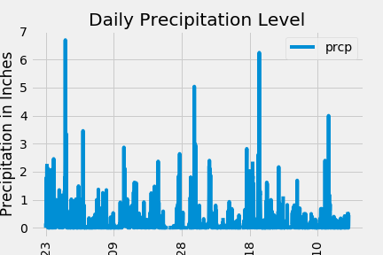
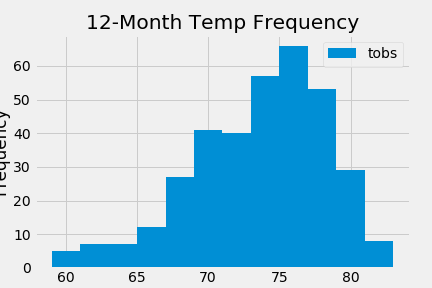

# sqlalchemy-challenge
Homework assignment for SQLAlchemy section of the course.

## Step 1 - Climate Analysis and Exploration
In this section, I put together the SQLAlchemy engine and automapped the Station and Measurement tables in Jupyter Notebook.

### Precipitation Analysis
For the precipitation analysis, I used a query to retrieve the most recent date in the data set and then entered the retrieved date into my query of the Measurement table.

I then loaded those query results into a Pandas dataframe called "past_year_df."

Using Matplotlib, I plotted the dataframe and got the following chart:

I then used Pandas to calculate summary statistics for the precipitation data.

### Station Analysis
For the station analysis, I began by querying the Station table to find out how many unique stations in the table (9).

Next, I used the func.count and group_by functions on the Station table to find the total number of observations per station and using the order_by function to order the stations by number of observations in descending order.

I then used the func.min, func.average, and func.max functions to calculate those three metrics for the station with the most observations.

Finally, I put the observation data for that same station into a Pandas dataframe and plotted the following histogram showing the frequency of temperatures in the past 12 months:

## Step 2 - Climate App
In creating the app, I created the Home page, Precipitation, Stations, Tobs, Start, and Start/End tables.

(I'm very tired and need to end my README file here...)